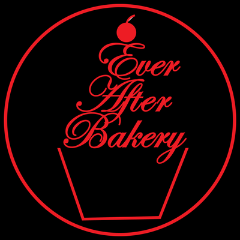

[![Contributors][contributors-shield]][contributors-url]
[![Forks][forks-shield]][forks-url]
[![Stargazers][stars-shield]][stars-url]
[![Issues][issues-shield]][issues-url]
[![MIT License][license-shield]][license-url]
[![LinkedIn][linkedin-shield]][linkedin-url]


<!-- PROJECT LOGO -->
<br />
<div id=”top”  align="center">
  <a href="https://github.com/Azurene/ever-after-bakery">
    
  </a>

<h3 align="center">Ever After Bakery</h3>

  <p align="center">
    Made in a Home Kitchen
    <br />
    <a href="https://github.com/Azurene/ever-after-bakery"><strong>Explore the docs »</strong></a>
    <br />
    <br />
    <a href="https://ever-after-bakery.herokuapp.com/">View Demo</a>
    ·
    <a href="https://github.com/Azurene/ever-after-bakery/issues">Report Bug</a>
    ·
    <a href="https://github.com/Azurene/ever-after-bakery/issues">Request Feature</a>
  </p>
</div>


<!-- TABLE OF CONTENTS -->
<details>
  <summary>Table of Contents</summary>
  <ol>
    <li>
      <a href="#about-the-project">About The Project</a>
      <ul>
        <li><a href="#built-with">Built With</a></li>
      </ul>
    </li>
    <li>
      <a href="#getting-started">Getting Started</a>
      <ul>
        <li><a href="#prerequisites">Prerequisites</a></li>
        <li><a href="#installation">Installation</a></li>
      </ul>
    </li>
    <li><a href="#usage">Usage</a></li>
    <li><a href="#roadmap">Roadmap</a></li>
    <li><a href="#contributing">Contributing</a></li>
    <li><a href="#license">License</a></li>
    <li><a href="#contact">Contact</a></li>
    <li><a href="#acknowledgments">Acknowledgments</a></li>
  </ol>
</details>


<!-- ABOUT THE PROJECT -->
## About The Project
Create Delightful Creations, indulge in desired goodies. Leaving a Ever After Memory. No place better made then a home kitchen !

<p align="right">(<a href="#top">back to top</a>)</p>


### Built With

* [Node.js](https://nodejs.org/en/)
* [GraphQL](https://graphql.org/)
* [Mongoose](https://mongoosejs.com/)
* [Express.js](https://expressjs.com/)
* [React.js](https://reactjs.org/)


<p align="right">(<a href="#top">back to top</a>)</p>


<!-- GETTING STARTED -->
## Getting Started

To get a local copy up and running follow these steps.

### Prerequisites

Install the latest version of npm.
* npm
  ```sh
  npm install npm@latest -g
  ```

### Installation

1. Clone the repo
   ```sh
   git clone https://github.com/Azurene/ever-after-bakery.git
   ```
2. Install NPM packages
   ```sh
   npm install
   ```

<p align="right">(<a href="#top">back to top</a>)</p>


<!-- USAGE EXAMPLES -->
## Demo

Link to [Live Version](https://ever-after-bakery.herokuapp.com/)


<p align="right">(<a href="#top">back to top</a>)</p>


<!-- ROADMAP -->
## Roadmap

- [ ] Implementing/ Updating a banner showing weekly News/specials

- [ ] Adding google maps Api to give updated location/directions
- [ ] Weekly/monthly Promotions given to registered customers / refer a friend discount
- [ ] Once ordered, customers can edit current order. For example: add additional / change the date / cancel order

See the [open issues](https://github.com/Azurene/ever-after-bakery/issues) for a full list of proposed features (and known issues).

<p align="right">(<a href="#top">back to top</a>)</p>


<!-- CONTRIBUTING -->
## Contributing

Contributions are what makes the open source community such an amazing place to learn, inspire, and create. Any contributions you make are **greatly appreciated**.

If you have a suggestion that would make this better, please fork the repo and create a pull request. You can also simply open an issue with the tag "enhancement".
Don't forget to give the project a star! Thanks again!

1. Fork the Project
2. Create your Feature Branch (`git checkout -b feature/AmazingFeature`)
3. Commit your Changes (`git commit -m 'Add some AmazingFeature'`)
4. Push to the Branch (`git push origin feature/AmazingFeature`)
5. Open a Pull Request

<p align="right">(<a href="#top">back to top</a>)</p>


<!-- CONTACT -->
## Contact

Jodee C
* Email: leaning.frets.08@icloud.com
* GitHub: https://github.com/Azurene

<p align="right">(<a href="#top">back to top</a>)</p>


<!-- ACKNOWLEDGMENTS -->
## Acknowledgments
This was a group project and here are the links to their githubs!
* [Krista G](https://github.com/krista20)
* [Angel S](https://github.com/santosangel1126)
* [Blake M](https://github.com/blakee-marcus)

<p align="right">(<a href="#top">back to top</a>)</p>


<!-- MARKDOWN LINKS & IMAGES -->
<!-- https://www.markdownguide.org/basic-syntax/#reference-style-links -->
[contributors-shield]: https://img.shields.io/github/contributors/Azurene/ever-after-bakery.svg?style=for-the-badge
[contributors-url]: https://github.com/Azurene/ever-after-bakery/graphs/contributors
[forks-shield]: https://img.shields.io/github/forks/Azurene/ever-after-bakery.svg?style=for-the-badge
[forks-url]: https://github.com/Azurene/ever-after-bakery/network/members
[stars-shield]: https://img.shields.io/github/stars/Azurene/ever-after-bakery.svg?style=for-the-badge
[stars-url]: https://github.com/Azurene/ever-after-bakery/stargazers
[issues-shield]: https://img.shields.io/github/issues/Azurene/ever-after-bakery.svg?style=for-the-badge
[issues-url]: https://github.com/Azurene/ever-after-bakery/issues
[license-shield]: https://img.shields.io/github/license/Azurene/ever-after-bakery.svg?style=for-the-badge
[license-url]: https://github.com/Azurene/ever-after-bakery/blob/master/LICENSE.txt
[linkedin-shield]: https://img.shields.io/badge/-LinkedIn-black.svg?style=for-the-badge&logo=linkedin&colorB=555
[linkedin-url]: https://linkedin.com/in/blake-marcus
[product-screenshot]: images/screenshot.png

